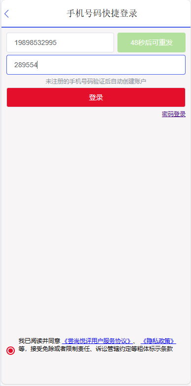
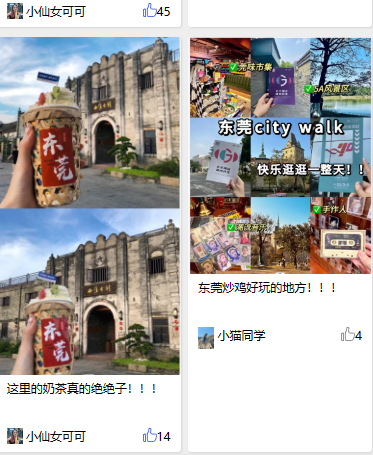
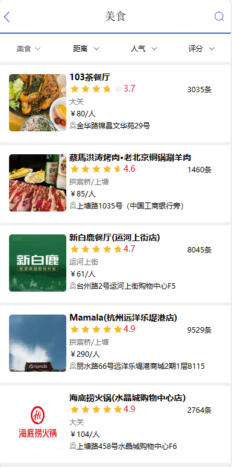
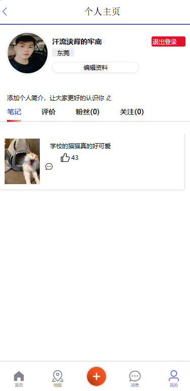
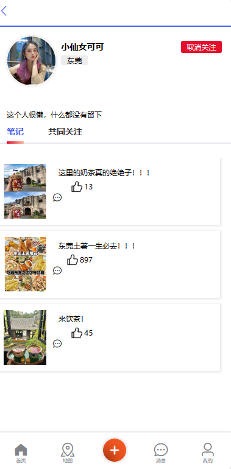
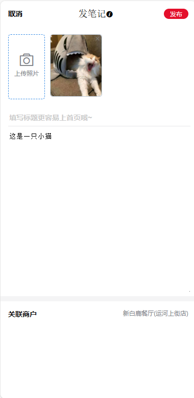
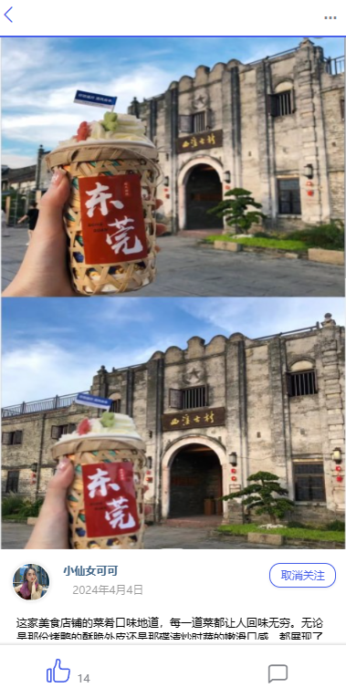
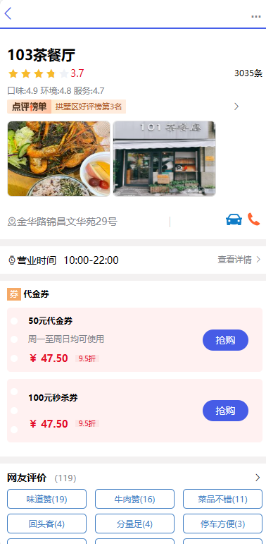

# 尝尚悦评项目

## 项目简介

该系统是一个综合性的用户点评平台，为用户提供丰富的本地商户信息和真实的用户评价，提供了用户注册登录，分类浏览店铺，博客推荐，用户点赞关注，个人信息查看与管理，店铺限时优惠券秒杀等服务。

## 项目展示

用户注册登录：

用户首页：

分类浏览店铺：

个人信息查看与管理：

用户点赞关注：

发布博客：

查看博客：

店铺信息浏览与优惠券抢购：

## 技术选型

### 前端

主要运用阿里 Ant Design 生态：

- 原生 HTML、CSS、JS 三件套
- Vue 2(渐进式使用)
- Element Ul组件库
- axios 请求库

### 后端

* Spring 相关：

Spring Boot 2.x
Spring MVC

* 数据存储层:
  MySQL：存储数据
  MyBatis Plus：数据访问框架

* Redis 相关：
  spring-data-redis：操作 Redis
  Lettuce：操作 Redis 的高级客户端

* Apache Commons Pool:用于实现 Redis 连接池Redisson:基于 Redis 的分布式数据网格
  工具库:
  HuTo01：工具库合集
  Lombok：注解式代码生成工具

* 中间件：

  RabbitMQ消息队列：实现异步创建订单操作

### 部署

- 单机部署
- Nginx
- 容器

